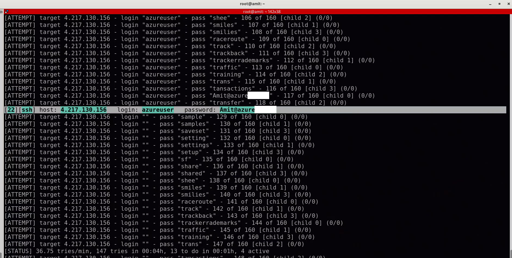
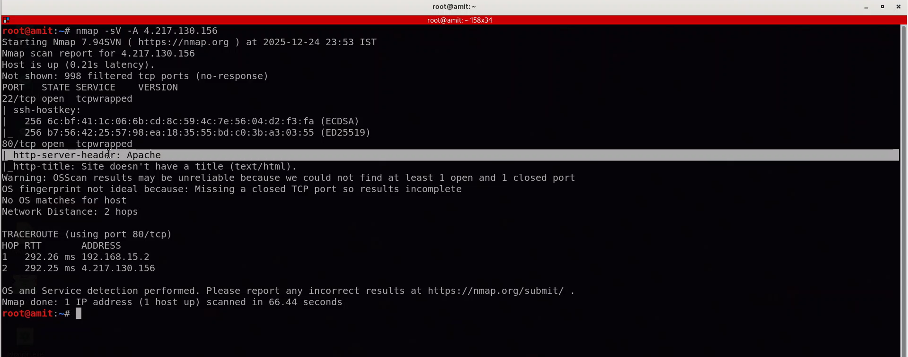

# 🛡️ Azure Cloud Security Lab: Red vs. Blue Team Simulation

## 📖 Project Overview
This project demonstrates the end-to-end lifecycle of a cloud security operation. I designed and deployed a secure, segmented corporate network on **Microsoft Azure**, simulated real-world cyberattacks (Red Team), analyzed the logs using a **SIEM (Wazuh)**, and implemented hardening measures to secure the infrastructure (Blue Team).

**Key Objectives:**
* Deploy a realistic cloud architecture with **DMZ** and **Internal** networks.
* Execute offensive security operations (Reconnaissance, Brute Force, Web Exploitation).
* Demonstrate **Lateral Movement** (Pivoting) from a compromised web server to an internal file server.
* Detect and analyze Indicators of Compromise (IOCs) using **Wazuh SIEM**.
* Remediate vulnerabilities through system hardening and firewall configurations.

---

## 🏗️ Architecture
The lab environment was built on Microsoft Azure with the following components:

* **Network:** Custom VNet with strict segmentation (DMZ Subnet vs. Internal Subnet).
* **VM1 (Internal Server):** A Samba File Server holding sensitive data. **No Public IP** (Isolated).
* **VM2 (Web Server):** An Apache Web Server acting as the public-facing entry point (DMZ).
* **VM3 (Security Hub):** Hosted the **Wazuh SIEM** Manager for centralized log aggregation and analysis.
* **Attacker Machine:** Kali Linux (used for external attacks).

---

## ⚔️ Phase 1: Red Team Operations (Attack)
In this phase, I acted as the attacker to identify vulnerabilities and compromise the system.

### 1. Reconnaissance & Scanning
* **Tools:** Nmap, Gobuster
* **Activity:** Scanned public-facing assets to identify open ports (22, 80) and enumerate web directories.
* **Result:** Discovered outdated Apache versions and exposed sshd services.

### 2. Exploitation (External)
* **Tools:** Hydra, Nikto
* **Activity:** Launched an SSH Brute Force attack against the Web Server and performed a web vulnerability scan.
* **Result:** Successfully cracked user credentials and generated high-volume 404/403 error logs.

### 3. Lateral Movement (Pivoting) 🚩
* **Concept:** Insider Threat Simulation.
* **Activity:** After compromising the Web Server (VM2), I used it as a "Jump Box" to scan the internal network.
* **Result:** Successfully discovered and brute-forced the **Internal File Server (VM1)**, which was invisible to the outside internet.

---

## 🛡️ Phase 2: Blue Team Operations (Defense)
In this phase, I acted as the SOC Analyst to investigate the attacks and secure the network.

### 1. Detection (SIEM Analysis)
Using the **Wazuh Dashboard**, I identified:
* **Brute Force Patterns:** A spike of 12,000+ authentication failures on Port 22.
* **Web Scanning:** Detection of "Nikto" user-agents and excessive 400-level error codes.
* **Internal Traffic:** Identified SSH connections originating from a private IP (Lateral Movement indicator).

### 2. Hardening & Remediation
To stop the attacks, I implemented the following fixes:
* **SSH Hardening:** Disbaled `PasswordAuthentication` and `PermitRootLogin` to stop brute-force attacks. Enforced Key-Based Authentication.
* **Web Server Hardening:** Configured `ServerTokens Prod` and `ServerSignature Off` to hide Apache version details (Security through Obscurity).
* **Network Security:** Tightened NSG rules to restrict internal traffic flow.

---

## 📊 Evidence & Screenshots

### 1. The Attack (Hydra Success)
*(Proof of compromised credentials)*

### 2. The Detection (Wazuh Dashboard Spike)
*(The moment the SIEM caught the attack)*

### 3. The Hardening (Clean Nmap Scan)
*(Proof that version info is now hidden)*

---

## 🛠️ Tools & Technologies Used
* **Cloud:** Microsoft Azure (VMs, VNet, NSG, Resource Groups).
* **Operating Systems:** Ubuntu Linux 20.04/22.04, Kali Linux.
* **Security Tools:** Wazuh (SIEM), Nmap, Hydra, Nikto, Gobuster.
* **Services:** Apache HTTP Server, Samba (SMB).

---

## ⚠️ Disclaimer
*This project was created for educational purposes and strictly followed ethical hacking guidelines. All attacks were performed on a private, isolated lab environment owned by me. No production systems or unauthorized networks were targeted.*
